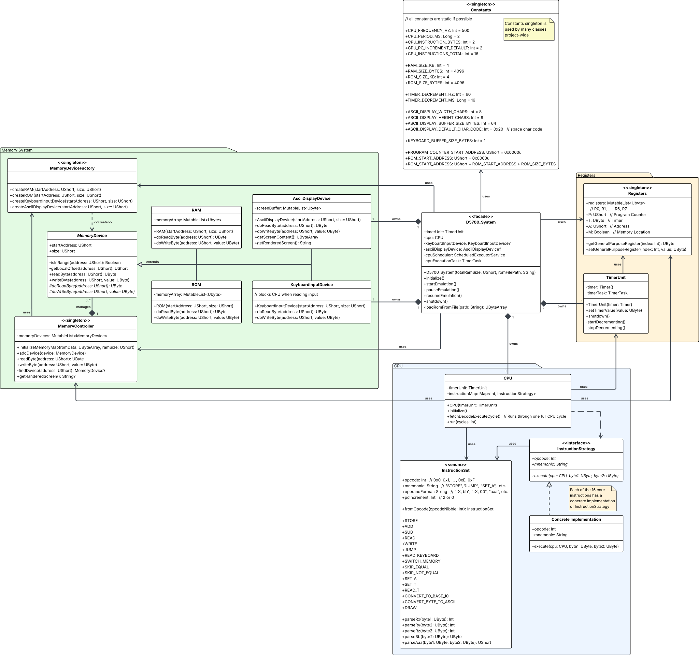

# D5700 Computer Emulator

## Submission Note

Unfortunately, I had a grave misunderstanding of the core memory model of this system.
I had assumed a standard unified memory model in which each memory device is placed sequentially in memory space.
After trying to run the provided ROMs,
I encountered the issue that each of them were trying to write to ROM rather than RAM,
due to the way they index memory addresses.
Looking back, this should have been clear to me,
since the split memory model seemed to be implied by the existence of a memory flag within the registers.

I have made the decision that I would rather turn in my complete and well-tested system with an incorrect memory model,
rather than one that is half-baked and poorly-tested with the correct memory model.
I believe this is the correct decision to make,
since I simply do not have the tim eto properly implement this change.

## Design Specifications

[Click here](docs/D5700_Data_Sheet.pdf)

## UML Diagram(s)

